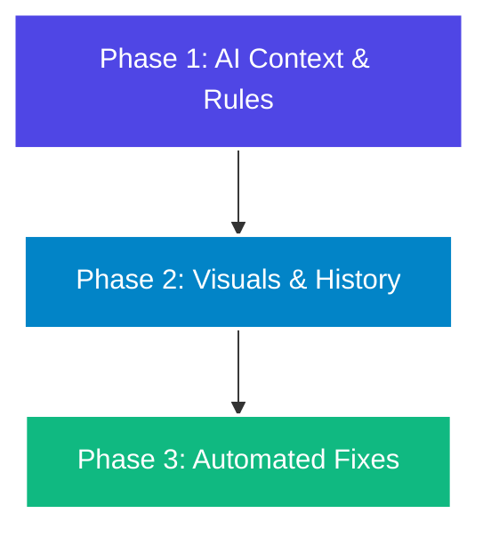

# ts-analyzer — Feature Roadmap 🚀

This document outlines the strategic vision for `ts-analyzer`, mapping out features designed to make it the ultimate code-quality companion for **AI-assisted coding**, **"vibe coders"**, and modern developer workflows.

---

## 🗺️ Roadmap at a Glance

---

## 🛠️ Phase 1: AI Context & Editor Rules (Token-Saver)
*Optimize the codebase structure to feed AI tools (Cursor, Claude, Gemini) high-density context without blowing token limits.*

- [ ] **`.cursorrules` / AI Rules Generator (`ts-analyzer --init-rules`)**
  * **Description**: Analyzes codebase patterns and automatically generates custom `.cursorrules` or `.claudeprompt` files tailored to the repository's needs.
  * **Vibe Benefit**: Guides your editor's AI to write code that adheres to your complexity and safety guidelines from day one.
- [ ] **AI Context Mapping (`--format context`)**
  * **Description**: Compiles a highly-condensed outline of the project's types, exports, and directory relationships.
  * **Vibe Benefit**: Gives chat LLMs deep system awareness in a single small file, avoiding the need to upload files manually.

---

## 🎨 Phase 2: Interactive Visualizations & History (Visual DX)
*Upgrade the HTML dashboard into an interactive developer dashboard with visual progression tracking.*

- [ ] **Interactive AST Dependency Graph**
  * **Description**: Renders a node-link diagram in the HTML report showing file dependencies.
  * **Vibe Benefit**: Nodes are color-coded by health (green/yellow/red). Hovering reveals lines of code, type safety, and smells.
- [ ] **Time-Travel Metrics & Historical Charts**
  * **Description**: Saves local snapshots under `.ts-analyzer/history.json` and renders interactive SVG timeline charts on the dashboard.
  * **Vibe Benefit**: Gamifies development by showing type coverage rising and cyclomatic complexity dropping over time.

---

## 🤖 Phase 3: Automated Remediation & CI Bots (Vibe Fix)
*Empower developers to analyze, fix, and merge clean code automatically.*

- [ ] **AI-Powered Code Refactoring Agent (`ts-analyzer --fix`)**
  * **Description**: Integrates with local models (via Ollama) or public APIs (Claude, OpenAI) to automatically rewrite functions flagged for anti-patterns.
  * **Vibe Benefit**: Instant fixes for Callback Hell or God Files. Just run the command and watch the AI clean your files.
- [ ] **"Vibe Check" PR Bot (GitHub Actions)**
  * **Description**: A GitHub Action companion that comments on pull requests with a beautifully formatted code-quality scorecard.
  * **Vibe Benefit**: Simplifies code review feedback down to clean scores (e.g., "PR Vibe Score: 96% safe").

---

## 💡 Contributing

Have ideas for new features or want to help implement one of these phases? Check out our [Contributing Guide](README.md#development--testing) and get involved!
